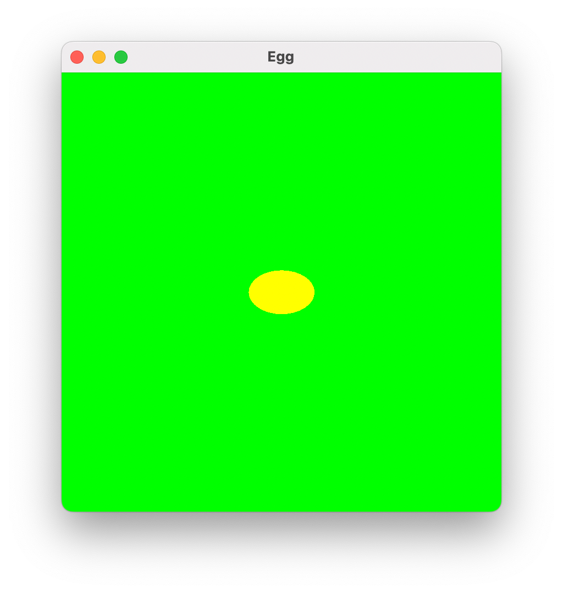

# [CSE2016] 2024년도 가을학기 프로그램설계방법론
## 한양대학교 ERICA 소프트웨어융합대학 컴퓨터학부 & 인공지능학과

### 실습 : 자라는 알 (Growing Egg)

- `javax.awt` 패키지의 `Graphics` 객체와 관련 메소드를 활용하여 크기가 점점 커지는 알을 그려봅시다.
- 실습 시간 안에 완성하여 조교에게 검사를 받습니다.
- 실습 시간 안에 완성을 못한 학생은 조교에게 출석을 확인하고 퇴실하세요.

#### 실습 1단계

- 다음을 만족하는 클래스 GrowingEgg를 생성하세요.
    - pixel 단위로 400x400 크기의 창을 생성한다.
    - 녹색 (`Color.green`) 바탕에 노란색 (`Color.yellow`)의 알 모양 타원을 정 가운데 보여준다.
    - 알의 크기는 너비가 60, 높이가 40 pixel 이다.
    - 창의 타이틀은 `Egg` 로 한다.



```java
import java.awt.*;
import javax.swing.*;

public class GrowingEgg extends JPanel {

	public GrowingEgg() {
		JFrame f = new JFrame();
		// ...
	}

	public void paintComponent(Graphics g) {
		// ...
	}

	public static void main(String[] args) {
		new GrowingEgg();
	}
}
```

#### 실습 2단계

- 다음을 만족하도록 클래스 GrowingEgg를 수정하세요.
    - 창을 최소화했다가 다시 활성화하면, paintComponent 메소드가 저절로 다시 실행되면서 창을 다시 그린다.
    - 창을 활성화 할 때 마다 알이 아래와 같이 너비 60, 높이 40 pixel 씩 자라도록 한다.
    - 알의 중심은 항상 일치해야 한다.


```java
import java.awt.*;
import javax.swing.*;

public class GrowingEgg extends JPanel {
	
	private final int NET_SIZE = 400;
	private int egg_width = 60;
	private int egg_height = 40;
	private int x = 170;
	private int y = 180;

	public GrowingEgg() {
		JFrame f = new JFrame();
		// ...
	}
	
	public void paintComponent(Graphics g) {
		// ...
	}

	public static void main(String[] args) {
		new GrowingEgg();
	}
}
```

#### 실습 3단계

- 다음을 만족하도록 클래스 GrowingEgg를 수정하세요.
    - 창의 크기를 400x400으로 고정하는 대신, GrowingEgg(400)과 같이 창의 크기를 사용자가 정할 수 있게 애플리케이션을 개선하자.
    - 알의 크기와 자라는 비율은 창의 크기와 비례해야 한다.
    - 알의 중심은 항상 일치해야 한다.


```java
import java.awt.*;
import javax.swing.*;

public class GrowingEgg extends JPanel {

	private int net_size;
	private int egg_width = 60;
	private int egg_height = 40;
	private int x = 170;
	private int y = 180;

	public GrowingEgg(int frame_size) {
		JFrame f = new JFrame();
		// ...
	}

	public void paintComponent(Graphics g) {
		// ...
	}

	public static void main(String[] args) {
		new GrowingEgg(600);
	}
}
```
