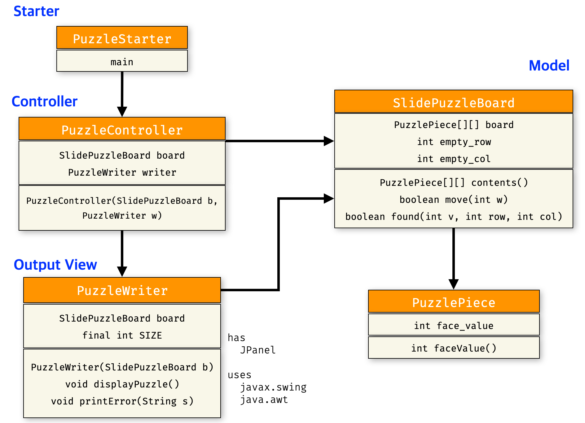

# [CSE2016] 2024년도 가을학기 프로그램설계방법론
## 한양대학교 ERICA 소프트웨어융합대학 컴퓨터학부 & 인공지능학과

### 실습 : 슬라이딩 퍼즐게임 만들기

- 지난 시간에 배운 배열을 사용해서 "슬라이딩 퍼즐게임"을 만들어 봅시다.
- 실습 시간 중 완성 후 조교에게 검사받기 바랍니다.

아래 MVC 아키텍처 기반으로 설계하고 클래스 다이어그램에 맞추어 구현합니다.



### 모델 클래스 `PuzzlePiece`

이 클래스는 퍼즐 한 조각을 만드는 모델 클래스이다. 퍼즐의 액면 값은 생성자 메소드로 초기화한다.

| 필드 | 역할 |
|:---:|:---|
| `int face_value` | 퍼즐 조각 위에 표시되는 값을 의미한다. |

| 메소드 | 역할 |
|:---:|:---|
| `int faceValue()` | 조각의 액면 값을 리턴한다. |

### 모델 클래스 `SlidePuzzleBoard`

이 클래스는 퍼즐 보드를 만드는 모델 클래스이다. 생성자 함수에서 다음 알고리즘대로 `board`를 초기화한다.

- 정수형 지역 변수 `number` 를 선언하고, 초기값을 1로 지정한다.
- 보드의 제일 마지막 열(row)부터 첫째 열까지 아래를 반복한다.
    - 보드의 제일 마지막 행(col)부터 첫째 행까지 아래를 반복한다.
        - `board[row][col]`에 액면 값이 `number`인 새로운 퍼즐 조각을 생성해서 넣는다.
        - `number` 값을 1 늘린다.

| 필드 | 역할 |
|:---:|:---|
| `PuzzlePiece[][] board` | 퍼즐보드를 의미한다. 2차원 배열로 구성하며, `board[row][col]`과 같이 사용한다. 생성자 함수에서 초기화한다. |
| `int empty_row` | 퍼즐보드에서 현재 비어있는 조각의 열(row)을 의미한다. |
| `int empty_col` | 퍼즐보드에서 현재 비어있는 조각의 행(col)을 의미한다. |

| 메소드 | 역할 |
|:---:|:---|
| `PuzzlePiece[][] contents()` | 퍼즐 보드를 리턴한다. |
| `boolean move(int w)` | `found` 메소드를 사용하여 현재 퍼즐보드에서 빈칸의 주변(상하좌우)에 움직이려는 조각이 있는지 확인하고 이동을 시도한다. 이동에 성공한 경우에 `true`를 리턴하고, 이동이 불가능하다면 `false`를 리턴한다. |
| `boolean found(int v, int row, int col)` | `board[row][col]`에 퍼즐 조각 `v`가 있는지 확인한다. |

### 출력 뷰 클래스 `PuzzleWriter`

이 클래스는 퍼즐 보드를 그리는 출력 뷰 클래스이다.

| 필드 | 역할 |
|:---:|:---|
| `SlidePuzzleBoard board` | 그릴 퍼즐보드를 담는다. |
| `final int SIZE` | 퍼즐 보드의 크기를 의미하며, 초기 값 |
| `int empty_row` | 퍼즐보드에서 현재 비어있는 열(row)을 의미한다. |
| `int empty_col` | 퍼즐보드에서 현재 비어있는 행(col)을 의미한다. |

| 메소드 | 역할 |
|:---:|:---|
| `int faceValue()` | 퍼즐 조각에 적힌 정수 값을 리턴한다. |

### 퍼즐 컨트롤러 클래스 `PuzzleController`

이 클래스는 슬라이드 퍼즐 조각의 움직임을 제어하는 클래스이다. 생성자 함수는 제어할 퍼즐보드(`board`) 와 출력 뷰 클래스(`writer`) 를 입력받아 초기화한다.
`play` 메소드는 다음과 같은 구조로 실행한다.

 - 출력 뷰 클래스로 퍼즐보드를 그린다.
 - 사용자에게 움직일 퍼즐 조각 번호를 입력받는다.
    - 해당 퍼즐 조각 번호의 이동을 시도한다.
    - 만약 입력받은 퍼즐 조각이 움직일 수 없는 번호라면, `printError` 메소드로 "움직일 수 없습니다." 라는 메시지를 보여주고, 다시 움직일 퍼즐 조각 번호를 입력받는다.

 - `JPanel.printError(String msg)` 메소드는 `msg` 를 담은 경고 창을 보여주는 메소드이다.

| 필드 | 역할 |
|:---:|:---|
| `SlidePuzzleBoard board` | 제어할 퍼즐보드를 담는다. |
| `PuzzleWriter writer` | 퍼즐보드를 그려주는 출력 뷰 클래스를 담는다. |

| 메소드 | 역할 |
|:---:|:---|
| `void play()` | 퍼즐게임을 시작한다. |

### 스타터 클래스 `PuzzleStarter`

```java
public class PuzzleStarter {

	public static void main(String[] args) {
		SlidePuzzleBoard board = new SlidePuzzleBoard();
		new PuzzleController(board, new PuzzleWriter(board)).play();
	}
}
```
