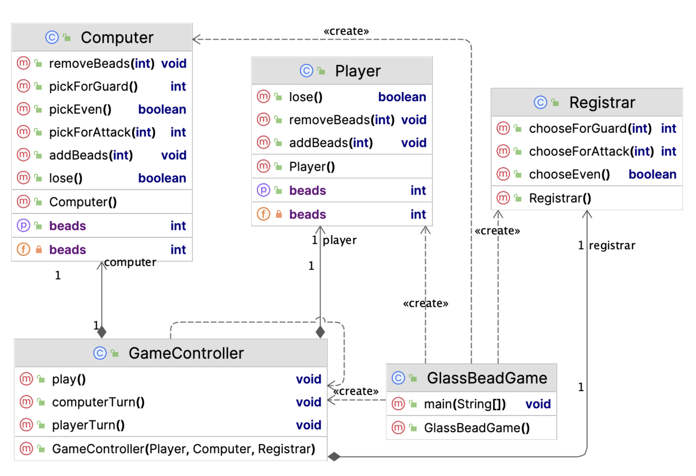

# [CSE2016] 2023년도 가을학기 프로그램설계방법론
## 한양대학교 ERICA 소프트웨어융합대학 인공지능학과

## 중간고사 라이브코딩 (v1.4.4)

- 시험 시간 중 완성 후 LMS 시스템으로 제출하기 바랍니다.
- 작성한 파일 중 java 파일만 압축해서 제출합니다.
	- `While2For.java`
	- `Player.java`
	- `Computer.java`
	- `Registrar.java`
	- `GameController.java`
	- `MarbleGame.java` (코드 내용을 제공함)
- 압축한 파일의 이름은 아래 포맷을 지켜주세요.
	- 학번이 2023000000 인 경우, `2023000000.zip`
	- 압축 포맷은 zip, tar, tar.gz, rar 만 허용합니다.
- 이 문서는 총 9쪽 입니다.

### 1. While 문을 For 문으로 바꾸기

제공한 [`whileToFor.java`](whileToFor.java) 파일 안에는 아래 함수가 (일부) 구현되어 있습니다.

| 메소드 | 역할 |
|:---:|:---|
| `double computerAverageWhile(int how_many)` | `how_many` 개 과목의 평균 점수를 `while` 루프를 사용해서 구하는 프로그램 |
| `double computerAverageFor(int how_many)` | `how_many` 개 과목의 평균 점수를 `for` 루프를 사용해서 구하려는 프로그램 |

`computerAverageFor` 함수를 완성해서 제출하세요.

### 2. 구슬 홀짝 맞추기 게임 구현

모 드라마에서 나왔던 구슬 홀짝 맞추기 게임을 구현해 봅시다.

컴퓨터와 구슬 홀짝 맞추기 게임을 하는 자바 애플리케이션을 만들자.

### 알고리즘
- 플레이어와 컴퓨터는 번갈아 가면서 다음과 같이 게임을 진행한다.
	- 0 : 플레이어와 컴퓨터는 각각 10개씩의 구슬을 가지고 시작한다.
	- 1 : 플레이어 공격, 컴퓨터 수비
		- 1.1. 컴퓨터는 0개에서 5개의 구슬을 랜덤으로 선택한다. 이때 구슬의 수는 컴퓨터가 가진 구슬의 수를 넘길 수 없다.
		- 1.2. 플레이어는 1개에서 5개의 구슬을 선택한다. 이때 선택하는 구슬은 컴퓨터가 가진 구슬의 수나 플레이어가 가진 구슬의 수를 넘길 수 없다.
		- 1.3. 플레이어는 컴퓨터가 선택한 구슬의 갯수를 짐작하여 짝/홀 중 하나를 선택한다.
		- 1.4. 플레이어가 선택한 짝/홀이 1.1에서 컴퓨터가 선택한 구슬의 짝/홀과 일치할 경우, 플레이어가 승리한다. 그렇지 않으면 플레이어가 패배한다.
			- 0, 2, 4 : 짝, 1, 3, 5 : 홀
		- 1.5. 플레이어가 승리하면 1.2에서 선택한 수만큼의 구슬을 컴퓨터로부터 받는다.
		- 1.6. 플레이어가 패배하면 1.2에서 선택한 수만큼의 구슬을 컴퓨터에게 준다.
	- 2 : 컴퓨터 공격, 플레이어 수비
		- 2.1. 플레이어는 0개에서 5개의 구슬을 선택한다. 이때 구슬의 수는 플레이어가 가진 구슬의 수를 넘길 수 없다.
		- 2.2. 컴퓨터는 1개에서 5개의 구슬을 랜덤으로 선택한다. 이때 선택하는 구슬은 컴퓨터가 가진 구슬의 수나 플레이어가 가진 구슬의 수를 넘길 수 없다.
		- 2.3. 컴퓨터는 랜덤으로 짝/홀 중 하나를 선택한다.
		- 2.4. 컴퓨터가 선택한 짝/홀이 2.1에서 플레이어가 선택한 구슬의 짝/홀과 일치할 경우, 플레이어가 패배한다. 그렇지 않으면 플레이어가 승리한다.
			- 0, 2, 4 : 짝, 1, 3, 5 : 홀
		- 2.5. 플레이어가 승리하면 2.2에서 선택한 수만큼의 구슬을 컴퓨터로부터 받는다.
		- 2.6. 플레이어가 패배하면 2.2에서 선택한 수만큼의 구슬을 컴퓨터에게 준다.
	- 1과 2를 반복해서 게임을 진행한다. 먼저 상대방의 구슬이 0개가 되면 승리한다.

### 실행예시

애플리케이션을 시작하면 다음과 같이 게임의 시작을 알리는 메시지와 함께, 플레이어와 컴퓨터가 가진 구슬의 수를 알려준다.

```
* 게임을 시작합니다...
당신의 구슬 : 10
컴퓨터의 구슬 : 10
```

이 후 공수를 바꿔가면서 게임을 진행한다. 아래는 플레이어가 공격을 하는 진행 예시이다.
```
* 당신의 공격!
당신은 5개의 구슬을 집었습니다.
당신은 짝을 선택했습니다.
컴퓨터가 손을 폅니다...
0개의 구슬입니다!
당신이 이겼습니다. 구슬 획득! : 5
당신의 구슬 : 15
컴퓨터의 구슬 : 5
* 컴퓨터의 공격!
당신은 3개의 구슬을 집었습니다.
컴퓨터가 2개의 구슬을 집어듭니다...
컴퓨터가 홀을 선택합니다...
당신이 졌습니다. 구슬 제출! : 2
당신의 구슬 : 13
컴퓨터의 구슬 : 7
* 당신의 공격!
```

<!-- 이 게임 보드 윈도우는 최소 정보만 텍스트로 표시한 것이다. 게임 보드 디자인은 각자 자유에 맡긴다. -->

둘 중 하나의 구슬이 0개가 된 순간 게임을 종료한다. 아래는 플레이어가 승리한 예시이다.
```
당신의 구슬 : 16
컴퓨터의 구슬 : 4
* 당신의 공격!
당신은 4개의 구슬을 집었습니다.
당신은 홀을 선택했습니다.
컴퓨터가 손을 폅니다...
1개의 구슬입니다!
당신이 이겼습니다. 구슬 획득! : 4
당신의 구슬 : 20
컴퓨터의 구슬 : 0
축하합니다! 당신의 승리입니다!
```

이 애플리케이션을 MVC 아키텍처 기반으로 설계한 다음 클래스 다이어그램에 맞추어 구현한다.



### 모델 클래스 `Player`

이 클래스는 플레이어의 모델 클래스이다.

| 필드 | 역할 |
|:---:|:---|
| `int beads` | 플레이어가 소지한 구슬의 수이다. 생성자 메소드에서 10으로 초기화한다. |

| 메소드 | 역할 |
|:---:|:---|
| `void addBeads(int n)` | 플레이어의 구슬을 `n`개 더한다. |
| `void removeBeads(int n)` | 플레이어의 구슬을 `n`개 뺀다. |
| `int getBeads()` | 플레이어가 소지한 구슬의 수를 리턴한다. |
| `boolean lose()`| 게임에 패배했는지 여부를 알려준다. (구슬이 없으면 패배) |

### 모델 클래스 `Computer`

이 클래스는 컴퓨터의 모델 클래스이다.

| 필드 | 역할 |
|:---:|:---|
| `int beads` | 컴퓨터가 소지한 구슬의 수이다. 생성자 메소드에서 10으로 초기화한다. |

| &nbsp;&nbsp;&nbsp;&nbsp;&nbsp;&nbsp;&nbsp;&nbsp;&nbsp;&nbsp;&nbsp;&nbsp;&nbsp;&nbsp;&nbsp;&nbsp;&nbsp;&nbsp;메소드&nbsp;&nbsp;&nbsp;&nbsp;&nbsp;&nbsp;&nbsp;&nbsp;&nbsp;&nbsp;&nbsp;&nbsp;&nbsp;&nbsp;&nbsp;&nbsp;&nbsp;&nbsp; | 역할 |
|:---:|:---|
| `void addBeads(int n)` | 컴퓨터의 구슬을 `n`개 더한다. |
| `void removeBeads(int n)` | 컴퓨터의 구슬을 `n`개 뺀다. |
| `int getBeads()` | 컴퓨터가 소지한 구슬의 수를 리턴한다. |
| `boolean lose()` | 게임에 패배했는지 여부를 알려준다. (구슬이 없으면 패배) |
| `int pickForAttack()` | 컴퓨터가 공격할 때 집을 구슬의 수를 무작위로 리턴한다. 최소값은 1, 최대값은 5이지만 현재 구슬의 수를 넘길 수는 없다. |
| `int pickForGuard()` | 컴퓨터가 방어할 때 집을 구슬의 수를 무작위로 리턴한다. 최소값은 0, 최대값은 5이지만 현재 구슬의 수를 넘길 수는 없다. |
| `boolean pickEven()` | 컴퓨터 공격시 선택한 홀/짝을 무작위로 리턴한다. `true`는 짝수, `false`는 홀수를 의미한다. |

### 인풋 뷰 클래스 `Registrar`

이 클래스는 플레이어에게 정보를 받아서 전달하는 기능을 갖고 있는 인풋 뷰 클래스이다.
`javax.swing` 패키지에서 제공하는 `JOptionPane`을 활용한다.

| &nbsp;&nbsp;&nbsp;&nbsp;&nbsp;&nbsp;&nbsp;&nbsp;&nbsp;&nbsp;&nbsp;&nbsp;&nbsp;&nbsp;&nbsp;&nbsp;&nbsp;&nbsp;&nbsp;&nbsp;&nbsp;&nbsp;&nbsp;메소드&nbsp;&nbsp;&nbsp;&nbsp;&nbsp;&nbsp;&nbsp;&nbsp;&nbsp;&nbsp;&nbsp;&nbsp;&nbsp;&nbsp;&nbsp;&nbsp;&nbsp;&nbsp;&nbsp;&nbsp;&nbsp;&nbsp;&nbsp; | 역할 |
|:---:|:---|
| `boolean chooseEven()` | 플레이어 공격시 홀/짝 여부를 입력받아 리턴한다. `true`는 짝수, `false`는 홀수를 의미한다. |
| `int chooseForAttack(int max)` | 플레이어가 공격 시 몇 개의 구슬을 집을지 입력받는다. `max`는 플레이어가 현재 가진 구슬의 수와 컴퓨터가 현재 가진 구슬의 수 중 작은 값을 입력받는다. 사용자의 입력은 최소 1에서 최대 5개까지 가능하나, 최대값이 `max`보다 클 수 없다. |
| `int chooseForGuard(int max)` | 플레이어가 방어 시 몇 개의 구슬을 집을지 입력받는다. `max`는 플레이어가 현재 가진 구슬의 수를 입력받는다. 사용자의 입력은 최소 0에서 최대 5개까지 가능하나, 최대값이 `max`보다 클 수 없다. |


### 컨트롤러 클래스 `GameController`

이 클래스는 구슬 홀짝 맞추기 게임을 총괄하여 진행하는 `play` 메소드와 함께 플레이어, 컴퓨터의 턴을 진행하는 두 메소드 `playerTurn`, `computerTurn` 을 구현하면 된다.
초기화 메소드에서 입력받은 세 객체를 필드변수로 저장하고, 다른 세 메소드에서 이 필드변수를 사용한다.

| 필드 | 역할 |
|:---:|:---|
| `Player player` | 컨트롤러 클래스가 접근하기 위해 저장한 `Player` 객체. |
| `Computer computer` | 컨트롤러 클래스가 접근하기 위해 저장한 `Computer` 객체. |
| `Registrar registrar` | 컨트롤러 클래스가 접근하기 위해 저장한 `Registrar` 객체. |

| &nbsp;&nbsp;&nbsp;&nbsp;&nbsp;&nbsp;&nbsp;&nbsp;&nbsp;&nbsp;&nbsp;&nbsp;&nbsp;&nbsp;&nbsp;&nbsp;&nbsp;&nbsp;&nbsp;&nbsp;&nbsp;&nbsp;&nbsp;&nbsp;&nbsp;&nbsp;&nbsp;&nbsp;&nbsp;&nbsp;&nbsp;&nbsp;&nbsp;&nbsp;&nbsp;&nbsp;&nbsp;&nbsp;&nbsp;&nbsp;&nbsp;메소드&nbsp;&nbsp;&nbsp;&nbsp;&nbsp;&nbsp;&nbsp;&nbsp;&nbsp;&nbsp;&nbsp;&nbsp;&nbsp;&nbsp;&nbsp;&nbsp;&nbsp;&nbsp;&nbsp;&nbsp;&nbsp;&nbsp;&nbsp;&nbsp;&nbsp;&nbsp;&nbsp;&nbsp;&nbsp;&nbsp;&nbsp;&nbsp;&nbsp;&nbsp;&nbsp;&nbsp;&nbsp;&nbsp;&nbsp;&nbsp;&nbsp; | 역할 |
|:---:|:---|
| `GameController(Player p, Computer c, Regstrar r)` | 생성자 메소드. 입력받은 세 객체 `Player`, `Computer`, `Registrar` 를 필드변수에 저장한다. |
| `void playerTurn()` | 플레이어의 턴을 진행한다. |
| `void computerTurn()` | 컴퓨터의 턴을 진행한다. |
| `void play()` | 플레이어와 컴퓨터의 턴을 어느 한쪽의 구슬이 모두 소진될 때까지 반복한다. |

게임 진행은 위에서 정의한 알고리즘을 참고하여 구현한다.

### 스타터 클래스 `MarbleGame`

`main` 메소드를 갖고 있는 스타터 클래스는 애플리케이션을 실행하는데 필요한 객체를 준비하고, `GameController` 객체를 만들어 `MarbleGame` 메소드를 호출하여 게임을 시작하게 한다.

완성한 `MarbleGame` 클래스는 다음과 같다.

```java
public class MarbleGame {
	public static void main(String[] args) {
		Player p = new Player();
		Computer c = new Computer();
		Registrar r = new Registrar();
		new GameController(p, c, r).play();
	}
}
```

### 힌트

| 메소드 및 코드 | 기능 |
|:---:|:---|
| `int Math.min(int a, int b)` | `a`와 `b` 중 작은 값을 리턴합니다. |
| `int Math.max(int a, int b)` | `a`와 `b` 중 큰 값을 리턴합니다. |
| `x % 2 == 0` | `x`를 `2`로 나눈 나머지가 `0`과 같은지 비교하면 `x`가 짝수인지를 알 수 있습니다. |
| `double Math.random()` | `0.0`이상 `1.0` 미만의 **실수**를 무작위로 리턴합니다. |
| `Math.random() * n` | `n`이 0 이상의 정수일 때, `0.0`이상 `n` 미만의 **실수**를 무작위로 리턴합니다. |
| ```(int)(Math.random() * n)``` | `n`이 0 이상의 정수일 때, `0` ~ `n-1` 의 **정수**를 무작위로 리턴합니다. |
| `(int)(Math.random() * n) + m` | `n`이 0 이상의 정수일 때, `m` ~ `n+m-1` 의 **정수**를 무작위로 리턴합니다. |
| `(int)(Math.random() * 6) + 1` | `1`~`6`의 수를 무작위로 리턴합니다. |

<br>

### 채점기준

라이브코딩의 총 배점은 30점이다.

- [3점] `computerAverageFor` 함수를 `computerAverageWhile` 함수와 동일하게 구현
- [3점] 모델 클래스 `Player` 의 구현
	- 필요한 요소(필드/메소드)가 하나 빠지거나 잘못 구현할 때마다 1점씩 감점한다.
- [4점] 모델 클래스 `Computer` 의 구현
	- 필요한 요소(필드/메소드)가 하나 빠지거나 잘못 구현할 때마다 1점씩 감점한다.
	- `pickForAttack` : 최대값이 현재 구슬을 반영하지 않을 경우 1점 추가 감점한다.
	- `pickForGuard` : 최대값이 현재 구슬을 반영하지 않을 경우 1점 추가 감점한다.
	- `pickEven` : `true`와 `false` 의 비중이 50:50 이어야 한다.
- [5점] 인풋 뷰 클래스 `Registrar` 의 구현
	- 아래 요소가 하나 빠지거나 잘못 구현할 때마다 1점씩 감점한다.
		- `chooseEven`
			- (1점) 정상적인 입력 조건(홀 혹은 짝)에서 제대로 동작하도록 구현한다. 입력한 문자열이 홀/짝 전후에 공백이 있는 경우에는 `trim` 메도스를 사용해서 정상입력으로 처리해야 한다.
			- (1점) 플레이어가 홀/짝 문자열 이외에 다른 문자열을 입력한 경우, 다시 입력받도록 해야한다.
		- `chooseForAttack`
			- (1점) 정상적인 입력 조건에서 제대로 동작하도록 구현한다.
			- (1점) 플레이어가 허용한 범위 이외의 값을 입력한 경우, 다시 입력받도록 해야한다.
		- `chooseForGuard`
			- (1점) 정상적인 입력 조건에서 제대로 동작하도록 구현한다.
			- (1점) 플레이어가 허용한 범위 이외의 값을 입력한 경우, 다시 입력받도록 해야한다.
- [15점] 컨트롤러 클래스 `GameController` 의 구현
	- (1점) 프로그램 시작 시 적절한 시작 메시지를 출력하여야 한다.
	- (2점) 프로그램 시작하는 시점과 플레이어와 컴퓨터의 턴이 끝날 때 마다 현재 구슬의 수를 출력해주어야 한다.
	- (1점) `playerTurn` 에서 `Registrar` 의 메소드 `chooseForAttack` 를 호출할 때, `max`값을 적절하게 전달하여야 한다.
	- (1점) `computerTurn` 에서 `Registrar` 의 메소드 `chooseForGuard` 를 호출할 때, `max`값을 적절하게 전달하여야 한다.
	- `play` 메소드에서,
		- (1점) 두 메소드 `playerTurn`와 `computerTurn`를 순서대로 번갈아가면서 호출해야 한다.
		- (1점) `playerTurn`를 호출한 다음, `computerTurn` 로 넘어가기 전에 게임이 종료되었는지 여부를 확인해야 한다.
	- (8점) 프로그램이 오류 없이 중단되지 않고 정상적으로 동작해야 한다.
	- 다음 메시지를 적절하게 출력해주어야 한다. (하나 놓칠때마다 1점씩 감점, 문구는 적절히 수정 가능)
		- `playerTurn` (플레이어의 공격)
			- 플레이어가 집은 구슬의 수 (예 : `당신은 5개의 구슬을 집었습니다.`)
			- 플레이어가 선택한 홀/짝 정보 (예 : `당신은 짝을 선택했습니다.`)
			- 컴퓨터가 쥐었던 구슬의 수 (예 : `컴퓨터가 손을 폅니다... 0개의 구슬입니다!`)
			- 플레이어의 승패여부 및 변경할 구슬의 수 (예 : `당신이 이겼습니다. 구슬 획득! : 5`)
		- `computerTurn`
			- 플레이어가 집은 구슬의 수 (예 : `당신은 3개의 구슬을 집었습니다.`)
			- 컴퓨터가 집은 구슬의 수 (예 : `컴퓨터가 2개의 구슬을 집어듭니다...`)
			- 컴퓨터가 선택한 홀/짝 정보 (예 : `컴퓨터가 홀을 선택합니다...`)
			- 플레이어의 승패여부 및 변경할 구슬의 수 (예 : `당신이 졌습니다. 구슬 제출! : 2`)

